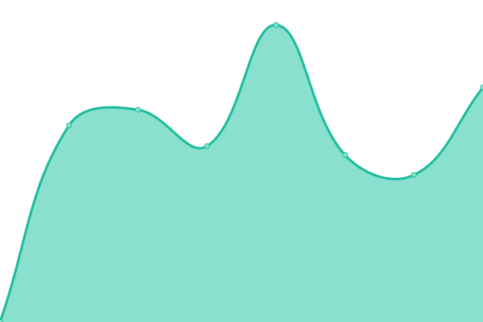
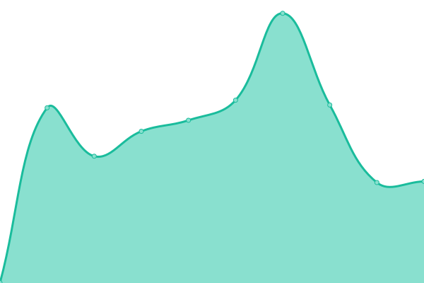
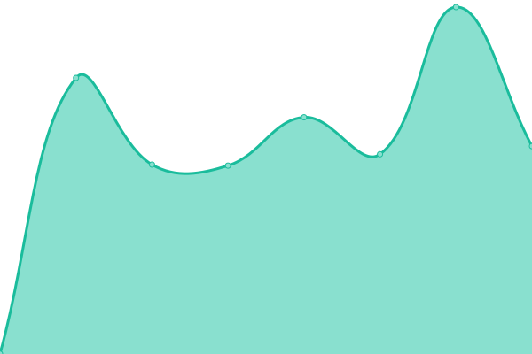

# [📈 Live Status](https://demo.upptime.js.org): <!--live status--> **🟥 Complete outage**

This repository contains the open-source uptime monitor and status page for [CS-METIS](https://demo.upptime.js.org), powered by [Upptime](https://github.com/upptime/upptime).

With [Upptime](https://upptime.js.org), you can get your own unlimited and free uptime monitor and status page, powered entirely by a GitHub repository. We use [Issues](https://github.com/CS-METIS/p1-status-page/issues) as incident reports, [Actions](https://github.com/CS-METIS/p1-status-page/actions) as uptime monitors, and [Pages](https://demo.upptime.js.org) for the status page.

<!--start: status pages-->
<!-- This summary is generated by Upptime (https://github.com/upptime/upptime) -->
<!-- Do not edit this manually, your changes will be overwritten -->
<!-- prettier-ignore -->
| URL | Status | History | Response Time | Uptime |
| --- | ------ | ------- | ------------- | ------ |
|  [AI4GEO main site](https://ai4geo.csgroup.eu/) | 🟥 Down | [ai-4-geo-main-site.yml](https://github.com/CS-METIS/p1-status-page/commits/HEAD/history/ai-4-geo-main-site.yml) | 

 6326ms
     
 | 

<a href="https://status.p1.csgroup.space/history/ai-4-geo-main-site">99.25%</a>
    

|  [P1 Landing page](https://p1.csgroup.space) | 🟥 Down | [p1-landing-page.yml](https://github.com/CS-METIS/p1-status-page/commits/HEAD/history/p1-landing-page.yml) | 

 0ms
     
 | 

<a href="https://status.p1.csgroup.space/history/p1-landing-page">0.00%</a>
    

|  [Data analytics](https://superset.p1.csgroup.space) | 🟥 Down | [data-analytics.yml](https://github.com/CS-METIS/p1-status-page/commits/HEAD/history/data-analytics.yml) | 

 0ms
     
 | 

<a href="https://status.p1.csgroup.space/history/data-analytics">0.00%</a>
    

|  [Feature server](https://feature.p1.csgroup.space/) | 🟥 Down | [feature-server.yml](https://github.com/CS-METIS/p1-status-page/commits/HEAD/history/feature-server.yml) | 

 0ms
     
 | 

<a href="https://status.p1.csgroup.space/history/feature-server">0.00%</a>
    

<!--end: status pages-->

[**Visit our status website →**](https://demo.upptime.js.org)

## 📄 License

- Powered by: [Upptime](https://github.com/upptime/upptime)
- Code: [MIT](./LICENSE) © [CS-METIS](https://demo.upptime.js.org)
- Data in the `./history` directory: [Open Database License](https://opendatacommons.org/licenses/odbl/1-0/)
