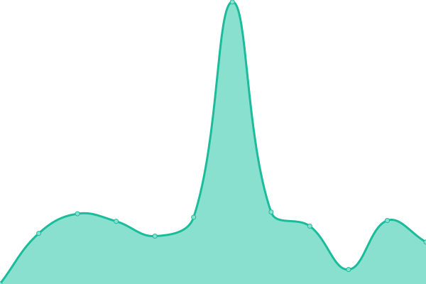

# [📈 Live Status](https://demo.upptime.js.org): <!--live status--> **🟩 All systems operational**

This repository contains the open-source uptime monitor and status page for [CS-METIS](https://demo.upptime.js.org), powered by [Upptime](https://github.com/upptime/upptime).

With [Upptime](https://upptime.js.org), you can get your own unlimited and free uptime monitor and status page, powered entirely by a GitHub repository. We use [Issues](https://github.com/CS-METIS/p1-status-page/issues) as incident reports, [Actions](https://github.com/CS-METIS/p1-status-page/actions) as uptime monitors, and [Pages](https://demo.upptime.js.org) for the status page.

<!--start: status pages-->
<!-- This summary is generated by Upptime (https://github.com/upptime/upptime) -->
<!-- Do not edit this manually, your changes will be overwritten -->
<!-- prettier-ignore -->
| URL | Status | History | Response Time | Uptime |
| --- | ------ | ------- | ------------- | ------ |
|  [AI4GEO main site](https://ai4geo.csgroup.eu/) | 🟩 Up | [ai-4-geo-main-site.yml](https://github.com/CS-METIS/p1-status-page/commits/HEAD/history/ai-4-geo-main-site.yml) | 

 8794ms
     
 | 

<a href="https://CS-METIS.github.io/p1-status-page/history/ai-4-geo-main-site">100.00%</a>
    

|  [P1](https://p1.csgroup.space) | 🟩 Up | [p1.yml](https://github.com/CS-METIS/p1-status-page/commits/HEAD/history/p1.yml) | 

 643ms
     
 | 

<a href="https://CS-METIS.github.io/p1-status-page/history/p1">100.00%</a>
    

|  [Data Analytics](https://superset.p1.csgroup.space) | 🟩 Up | [data-analytics.yml](https://github.com/CS-METIS/p1-status-page/commits/HEAD/history/data-analytics.yml) | 

 1225ms
     
 | 

<a href="https://CS-METIS.github.io/p1-status-page/history/data-analytics">100.00%</a>
    

|  [PGAdmin](https://pgadmin.p1.csgroup.space) | 🟩 Up | [pg-admin.yml](https://github.com/CS-METIS/p1-status-page/commits/HEAD/history/pg-admin.yml) | 

 427ms
     
 | 

<a href="https://CS-METIS.github.io/p1-status-page/history/pg-admin">100.00%</a>
    

|  [PGAdmin](https://pgadmin.p1.csgroup.space) | 🟩 Up | [pg-admin.yml](https://github.com/CS-METIS/p1-status-page/commits/HEAD/history/pg-admin.yml) | 

 427ms
     
 | 

<a href="https://CS-METIS.github.io/p1-status-page/history/pg-admin">100.00%</a>
    

<!--end: status pages-->

[**Visit our status website →**](https://demo.upptime.js.org)

## 📄 License

- Powered by: [Upptime](https://github.com/upptime/upptime)
- Code: [MIT](./LICENSE) © [CS-METIS](https://demo.upptime.js.org)
- Data in the `./history` directory: [Open Database License](https://opendatacommons.org/licenses/odbl/1-0/)
